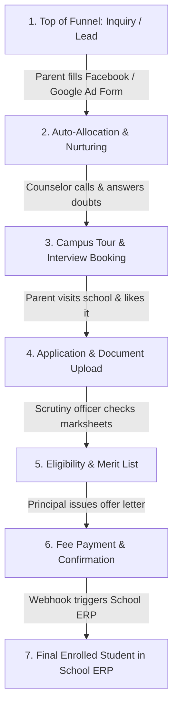

# Tutorial 1: The Big Picture & The Admission CRM Process

Welcome to backend engineering! Before writing code or configuring databases, you need a crystal-clear mental model of **what a backend actually does** and **the business process we are digitizing for SimplyAdmission**.

---

## 1. What is a "Backend" in Simple Words?
When a parent or student visits the school website:
* **The Frontend (UI)**: Is what they see and touch on their phone or laptop (buttons, text boxes, images, forms). Think of the frontend as the **dining area and menu card** in a restaurant.
* **The Backend (Our Job)**: Is the **kitchen, inventory manager, billing desk, and security guard** behind the scenes. 
  * It validates the student's information.
  * It stores records securely in a permanent vault (Database).
  * It calculates admission eligibility scores.
  * It coordinates with banks to collect fees.
  * It triggers WhatsApp messages and emails.
  * It makes sure School A's staff never accidentally sees School B's students (Multi-Tenancy).

---

## 2. The 7-Stage Admission Journey in SimplyAdmission

Here is the exact lifecycle of a student inquiry inside SimplyAdmission:

### Stage 1: Inquiry / Lead Capture
* **What happens**: A parent browsing Facebook or Google sees an ad for "Admissions Open for Grade 1 at DPS". They enter their name, phone number, and child's age.
* **Backend's Job**: The ad platform sends this data to our server via a **Webhook**. Our server must verify it's not fake spam, clean the phone number format, and save it in milliseconds.

### Stage 2: Lead Allocation & Nurturing
* **What happens**: The lead must not sit unattended. It needs to be handed to an active counselor immediately.
* **Backend's Job**: A **Round-Robin Algorithm** picks the next available counselor, adds the lead to their dashboard, and fires an automated WhatsApp welcome message to the parent.

### Stage 3: Campus Tour & Slot Scheduling
* **What happens**: The counselor invites the parent for a physical campus walkthrough or principal interview.
* **Backend's Job**: A booking system locks a 30-minute time slot, prevents two parents from booking the exact same principal slot, and sends calendar invites (`.ics` files).

### Stage 4: Formal Application & Document Upload
* **What happens**: The parent fills out the formal multi-page admission form and uploads the child's birth certificate and previous report card.
* **Backend's Job**:
  * Different schools have different questions (e.g., "Bus Route Required?", "Sibling in same school?"). The backend handles this dynamically using PostgreSQL `JSONB`.
  * The documents are safely stored in cloud storage (AWS S3) and scanned for viruses.

### Stage 5: Document Scrutiny & Verification
* **What happens**: A school scrutiny officer reviews the uploaded birth certificate. If clear, they click "Approve"; if blurry, they click "Reject with reason".
* **Backend's Job**: Updates the student's status and automatically sends a WhatsApp/SMS alert to the parent asking for a clearer photo.

### Stage 6: Offer Letter & Online Fee Payment
* **What happens**: The child is selected! The school issues a provisional admission letter and asks for a ₹25,000 admission registration fee.
* **Backend's Job**:
  * Merges student data into an official school letterhead PDF.
  * Connects with payment gateways (Razorpay/Cashfree).
  * Listens for the bank's confirmation webhook, generates an official GST fee receipt, and marks the fee as "Paid".

### Stage 7: Handshake with the School ERP
* **What happens**: The admission process in the CRM is now complete. The child is no longer just a "lead"—they are a permanent enrolled student.
* **Backend's Job**: The CRM fires an **Outgoing Webhook** to the school's legacy ERP system (e.g., student attendance and fee management system) to generate a permanent Roll Number and assign a classroom section.

---

## 3. The Three Golden Rules of SimplyAdmission Backend
1. **Never Drop an Inquiry**: If Facebook sends 10,000 inquiries during an ad blitz, our server must buffer them in queues so no parent is lost.
2. **Strict Multi-Tenancy**: Data between schools is 100% sacred. A counselor at "School X" must never be able to access or query leads from "School Y".
3. **Idempotency in Money**: If a parent clicks "Pay Application Fee" three times because their WiFi was slow, they must only be charged once.
