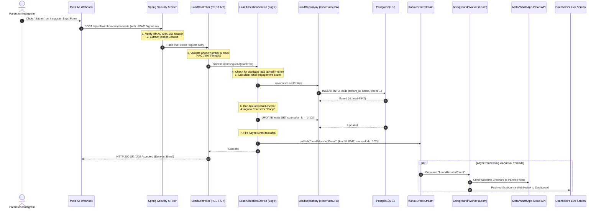

# Tutorial 3: Tracing a Request (The Life of an Inquiry)

To truly understand backend engineering, you must be able to visualize what happens to a single packet of data as it travels through the system.

Let's trace a real scenario: **A parent clicks "Submit Inquiry" on an Instagram Ad for Delhi Public School.**

---

## 🎬 Step-by-Step Architecture Trace



---

## 🔍 Breaking Down Each Phase

### 1. The Security Filter & Gateway
* Before our controller even touches the data, the **Spring Security Filter** intercepts the request.
* It checks the cryptographic signature (`X-Hub-Signature-256`) sent by Meta. If a hacker tries to send fake lead data to our API, the filter rejects it with `401 Unauthorized` before it can touch our database.

### 2. The Controller (The Front Door)
* The `LeadController` uses Java annotations like `@Valid`, `@NotNull`, and `@Pattern` to ensure:
  * The phone number is a valid 10 to 12 digit number.
  * The student name is not blank.
* If validation fails, the controller immediately returns a structured JSON error (`RFC 7807 ProblemDetail`), e.g., `"phoneNumber": "Invalid format"`.

### 3. The Service (The Brain)
* The `LeadAllocationService` coordinates the business rules:
  * Has this parent already enquired in the last 30 days? (Deduplication).
  * Which grade are they applying for?
  * What is the current workload of counselors in this campus?
  * It calls our **`RoundRobinAllocator`** to pick the next active counselor.

### 4. The Repository & Database (The Vault)
* Using **Spring Data JPA** and **Hibernate**, our Java `Lead` object is converted into a SQL query:
  ```sql
  INSERT INTO leads (tenant_id, campus_id, student_name, phone_number, stage, counselor_id)
  VALUES ('tenant_dps', 'campus_vasant_kunj', 'Aarav Sharma', '+919876543210', 'NEW', 'c-102');
  ```
* PostgreSQL writes the record to disk with ACID guarantees.

### 5. The Fast Response (35 Milliseconds)
* Notice that we send `HTTP 200 OK` back to Meta right away!
* We do **NOT** make Meta or the parent wait while we connect to WhatsApp or send emails. We respond in **under 50 milliseconds**.

### 6. The Asynchronous Worker (Virtual Threads)
* In the background, **Apache Kafka** triggers a worker.
* The worker uses **Java 21 Virtual Threads** to make an outbound HTTP POST call to the **WhatsApp Business API**, delivering a brochure to the parent's phone and pinging counselor Pooja's dashboard:
  > *"Ding! New lead allocated: Aarav Sharma (Grade 5). Contact within 15 minutes."*

---

## 🧠 What You Now Understand:
1. Why we split code into **Controller ➔ Service ➔ Repository**.
2. Why we validate early before touching the database.
3. Why we use **Kafka** to keep the user-facing API lightning fast.
4. How all these pieces fit together to power SimplyAdmission!
