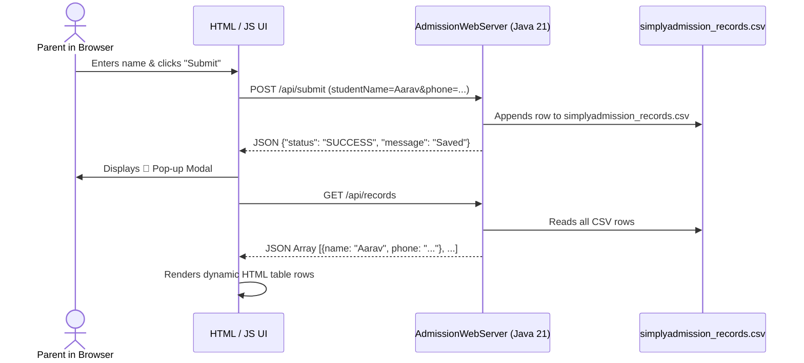

# Tutorial 5: Building & Running Your First Local Web App in IntelliJ IDEA

This tutorial guides you step-by-step on how to open your project in **IntelliJ IDEA**, run your local web application, and see your buttons, forms, popups, and persistent data saving live in your browser!

---

## 🌟 What This Web App Features
1. **Interactive Form**: Input fields for Student Name, Parent Phone, Grade, and Campus.
2. **Submit Button**: Submits data via an asynchronous HTTP POST request (`fetch` API).
3. **Pop-up Modal**: A sleek confirmation dialog that appears automatically upon successful submission.
4. **Live Data Table**: Automatically reloads and displays all saved student applications in a clean tabular view.
5. **Disk Persistence**: Every application you submit is permanently saved to a file (`simplyadmission_records.csv`) in your project folder!
6. **Zero Dependencies**: Runs on standard Java 21 without requiring Maven downloads or external libraries!

---

## 🛠️ Step-by-Step Setup in IntelliJ IDEA

### Step 1: Open the Project in IntelliJ IDEA
1. Launch **IntelliJ IDEA** on your computer.
2. On the welcome screen, click **Open** (or go to `File` ➔ `Open...`).
3. Browse to your project folder: `D:\Alok\.project\java` and click **OK**.
4. Choose **Trust Project** if prompted.

### Step 2: Configure the Java 21 SDK
1. In the top menu, go to `File` ➔ `Project Structure...` (Shortcut: `Ctrl + Alt + Shift + S`).
2. Under **Project Settings**, click **Project**.
3. Look at the **SDK** dropdown:
   * Select **Microsoft OpenJDK 21** (or browse to `C:\Program Files\Microsoft\jdk-21.0.12.101-hotspot`).
4. Set **Language level** to `21 - Pattern matching, records, virtual threads`.
5. Click **Apply** and then **OK**.

### Step 3: Locate the Web App Code
In the left **Project Navigation Pane**, expand the folders:
```
java/
 └── src/
      └── main/
           └── java/
                └── com/
                     └── simplyadmission/
                          └── webapp/
                               └── AdmissionWebServer.java   <-- Double-click to open this file!
```

---

## ▶️ Step 4: Run the Application!
1. Right-click inside the `AdmissionWebServer.java` file editor.
2. Click **Run 'AdmissionWebServer.main()'** (or click the green **Play ▶️** arrow near line 25, or press `Shift + F10`).
3. Look at the bottom **Run Terminal Window** in IntelliJ. You will see:
   ```
   ==================================================================
   🚀 SimplyAdmission Local Web App is LIVE!
   👉 Open your browser and go to: http://localhost:8080
   👉 Data is being saved permanently to: D:\Alok\.project\java\simplyadmission_records.csv
   ==================================================================
   ```

---

## 🌐 Step 5: Test in Your Browser!
1. Open your web browser (Chrome, Edge, or Brave).
2. Type `http://localhost:8080` in the URL bar and press Enter.
3. You will see the **SimplyAdmission Portal**:
   * Type a student name: `Aarav Sharma`
   * Type a parent phone: `+91 9876543210`
   * Pick a Grade: `Grade 5`
   * Pick a Campus: `DPS Vasant Kunj`
   * Click **🚀 Submit & Save Application**!
4. **Watch the Magic Happen**:
   * 🎉 A smooth pop-up dialog appears: *"Application Received! Saved student: Aarav Sharma"*.
   * Click *"OK, Awesome!"* to dismiss the pop-up.
   * Look down at the table: The new student record is rendered in the live table!

---

## 💾 Step 6: Verify the Saved Data on Disk
1. Switch back to IntelliJ IDEA or Windows File Explorer.
2. In your project root folder, you will see a newly created file: `simplyadmission_records.csv`.
3. Open it, and you will see your persistent record:
   ```csv
   TIMESTAMP,NAME,PHONE,GRADE,CAMPUS,STATUS
   2026-09-06 10:25:14,Aarav Sharma,+91 9876543210,Grade 5,Vasant Kunj,NEW
   ```
4. Even if you restart your server or turn off your laptop, the data is permanently preserved!

---

## 🧠 Behind the Scenes: How It Works



### Key Technical Concepts You Just Used:
1. **HTTP Methods**: `GET` (for fetching the page and records) vs `POST` (for submitting and saving data).
2. **Java 21 Virtual Threads**: In `AdmissionWebServer.java`, line 42:
   ```java
   server.setExecutor(Executors.newVirtualThreadPerTaskExecutor());
   ```
   Every single browser click runs on a lightweight virtual thread!
3. **Data Deserialization**: The server converts raw URL-encoded form data into a Java `Map<String, String>`.
4. **Data Persistence**: Uses modern `java.nio.file.Files.writeString` with `StandardOpenOption.APPEND` to reliably write rows to disk.
