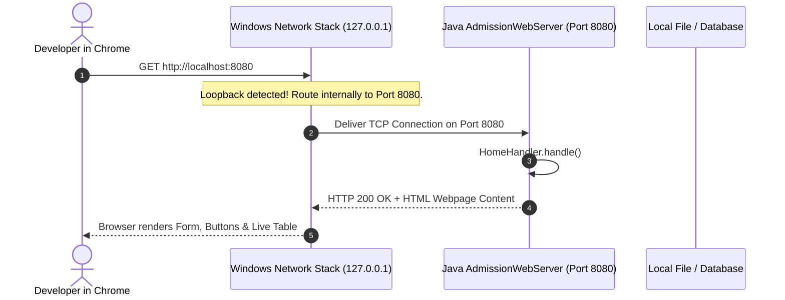

# Tutorial 6: How Localhost Works & The Scope of Work (GET, POST & HTTP)

Before launching any web application to the public internet, 100% of development happens on **`localhost`**. This tutorial explains what localhost really is, what happens inside your computer when you use it, and how HTTP methods like `GET` and `POST` work.

---

## 1. What is `localhost`? (The Loopback Mirror)

When you type `google.com` into your browser, your computer sends radio/cable signals out through your router, across the internet, to Google's server computers.

When you type **`http://localhost`**, your operating system intercepts the request and says:
> *"Wait! Don't send this out to the WiFi or internet. Send it right back to **this exact laptop**!"*

```
                     ┌────────────────────────────────────────────────────────┐
                     │                 YOUR LAPTOP / COMPUTER                 │
                     │                                                        │
┌──────────────┐     │  ┌─────────────────┐             ┌──────────────────┐  │
│ Google.com   │ ◄───┼──│   Web Browser   │             │ Admission Server │  │
│ (Internet)   │     │  │ (Chrome / Edge) │             │ (Java 21 Engine) │  │
└──────────────┘     │  └────────┬────────┘             └────────▲─────────┘  │
                     │           │                               │            │
                     │           │  http://localhost:8080        │            │
                     │           └───────────────────────────────┘            │
                     │               (Loopback: 127.0.0.1)                    │
                     └────────────────────────────────────────────────────────┘
```

### The Three Core Parts of `http://localhost:8080`:
1. **`http://` (The Protocol)**: The language rules the browser and server use to talk to each other.
2. **`localhost` (The Host Address)**: An alias for the special IP address **`127.0.0.1`** (known as the **Loopback Adapter**). It always points to the machine you are sitting in front of.
3. **`:8080` (The Port Number)**: Imagine your computer is an apartment building. The IP address (`127.0.0.1`) is the building address. The **Port** (`:8080`) is the specific apartment number where your Java program lives.
   * If your Java server is listening on door `8080`, and Chrome knocks on door `8080`, they connect!

---

## 2. What Happens When You Press Enter on `localhost:8080`?



---

## 3. The Scope of Work in HTTP: `GET` vs `POST`

HTTP defines different "actions" (verbs) depending on what the user is trying to do. In backend development, mastering `GET` and `POST` is fundamental.

| Feature | `GET` Request | `POST` Request |
| :--- | :--- | :--- |
| **Primary Purpose** | **Fetch & Read** data without changing anything on the server. | **Submit & Save** new data (state-changing). |
| **Data Location** | Data is passed in the URL (e.g., `?studentId=101`). | Data is hidden inside the **Request Body** (Payload). |
| **Idempotency** | **Safe & Idempotent**: Calling it 100 times changes nothing. | **Non-Idempotent**: Calling it twice may insert two students or charge money twice! |
| **Browser Caching** | Browsers cache GET responses to load faster. | Browsers **never** cache POST requests. |
| **History & Bookmarks** | Can be bookmarked in browser history. | Cannot be bookmarked directly. |

### Concrete CRM Examples in SimplyAdmission:
* **`GET /`**: Loads the application form webpage (safe to refresh).
* **`GET /api/records`**: Reads and returns all saved student rows from disk.
* **`GET /api/leads?grade=Grade5`**: Filters inquiries for Grade 5.
* **`POST /api/submit`**: Submits a new student form. Saves the record to disk.
* **`POST /api/payments/charge`**: Deducts an application fee.

---

## 4. Other Essential HTTP Verbs in REST APIs

As you advance, you will use two more methods:
* **`PUT / PATCH` (Update)**:
  * Example: `PUT /api/leads/8942/stage` ➔ Updates the student's status from `NEW` to `CONTACTED`.
* **`DELETE` (Remove)**:
  * Example: `DELETE /api/leads/8942` ➔ Soft-deletes a spam inquiry from the counselor's list.

---

## 5. HTTP Status Codes: The Server's Mood Ring
Whenever your Java server answers a browser request, it returns a 3-digit status code:

* **`2xx Success`**:
  * `200 OK`: Request succeeded, here is your data or HTML.
  * `201 Created`: New student record was successfully created and saved.
* **`4xx Client Error` (The Browser Made a Mistake)**:
  * `400 Bad Request`: Form was missing required fields (e.g., blank phone number).
  * `401 Unauthorized`: No valid login or invalid password.
  * `404 Not Found`: The requested URL or student ID doesn't exist.
  * `405 Method Not Allowed`: You sent a `POST` request to an endpoint that only accepts `GET`.
* **`5xx Server Error` (Our Backend Code Crashed)**:
  * `500 Internal Server Error`: An unhandled Java exception (e.g., `NullPointerException`).
  * `503 Service Unavailable`: The server or database is overloaded.

---

## 6. What Can You Do on `localhost`? (The Development Sandbox)

`localhost` is your private flight simulator. You can test and break things without affecting real users or spending money:

1. **Test Concurrency**: Fire 1,000 simulated parents at your local server using a script to see if your Java code deadlocks.
2. **Mock Third-Party APIs**: Instead of paying for real WhatsApp or SMS messages, you create a mock endpoint on `localhost` that logs: `"[SIMULATED SMS] Sent OTP to 9876543210"` to your console.
3. **Inspect with Browser DevTools (F12)**:
   * Press **F12** in Chrome ➔ click the **Network** tab.
   * Submit the form on `http://localhost:8080`.
   * You can inspect the exact headers, payload, status code, and milliseconds it took your Java server to respond!
