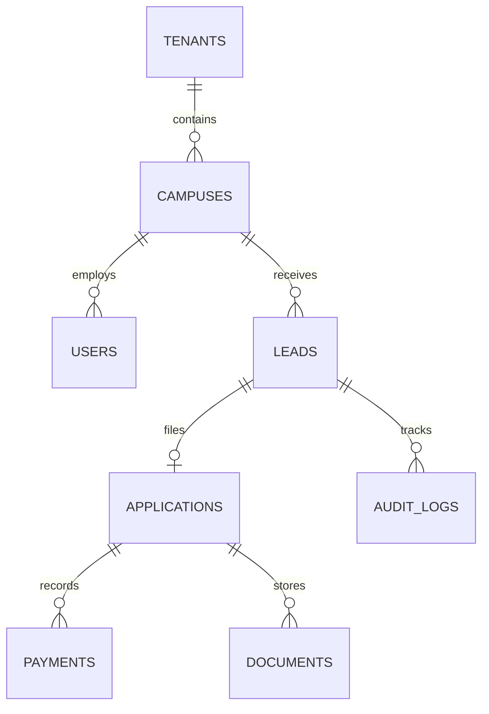
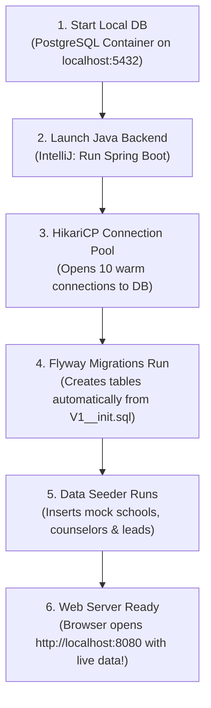

# Tutorial 7: Database Debugging & How Databases Power Local Web App Instances

In modern backend engineering, **the database is the ultimate source of truth**. When software fails or bugs occur, the UI may hide the error, but the database will always tell you the exact truth of what happened.

This tutorial covers:
1. **What an Admission CRM Database contains**.
2. **How developers query the DB to hunt down and fix real bugs**.
3. **How the database powers a local instance of a web application** (architecture, migrations, connection pools, and seeding).

---

## 1. What Does the SimplyAdmission Database Contain?

A database is an organized collection of related **tables** (like smart spreadsheets that link to each other). Here are the primary tables in SimplyAdmission:



### Key Tables & Their Contents:
1. **`tenants`**: Holds the institution organization.
   * *Columns*: `id`, `name` (e.g., "Delhi Public School Society"), `subdomain` ("dps"), `created_at`.
2. **`campuses`**: Specific school branches.
   * *Columns*: `id`, `tenant_id`, `branch_name` ("Vasant Kunj"), `city`, `pincode`.
3. **`users` (Counselors / Admins)**: Staff accounts.
   * *Columns*: `id`, `campus_id`, `name`, `email`, `role` (`COUNSELOR`, `ADMIN`), `is_active`.
4. **`leads`**: Prospective inquiries from marketing.
   * *Columns*: `id`, `student_name`, `parent_phone`, `stage` (`NEW`, `CONTACTED`, `TOUR_BOOKED`), `counselor_id`, `engagement_score`.
5. **`applications`**: Formal registration forms.
   * *Columns*: `id`, `lead_id`, `grade_applied`, `status` (`SUBMITTED`, `SCRUTINY_PASSED`, `OFFER_ISSUED`, `ENROLLED`), `custom_data` (PostgreSQL `JSONB` for custom school questions).
6. **`payments`**: Financial transaction ledger.
   * *Columns*: `id`, `application_id`, `gateway_tx_id` ("pay_Nx8481hjs"), `amount` (25000.00), `currency` ("INR"), `status` (`INITIATED`, `SUCCESS`, `FAILED`), `idempotency_key`.
7. **`audit_logs` (The Detective's Journal)**:
   * Every time anything changes, a row is inserted here.
   * *Columns*: `id`, `entity_type` ("LEAD"), `entity_id` ("lead-101"), `action` ("STAGE_CHANGED"), `old_val` ("NEW"), `new_val` ("CONTACTED"), `performed_by` ("user-5"), `timestamp`.

---

## 2. "Get DB to Find Out the Bug": How Database Debugging Works

When an admission counselor or parent complains: *"Something is broken!"*, a backend engineer opens their database client (IntelliJ Database Tool or DBeaver) and writes SQL queries to diagnose the root cause.

Here are **3 real-world debugging scenarios**:

### Scenario A: "The Parent Paid ₹25,000, but their status is still 'PENDING'!"
* **The Complaint**: The parent's bank debited their money, but the admission portal won't let them download their offer letter.
* **How the Backend Dev checks the DB**:
  ```sql
  -- Step 1: Find the payment row for this application
  SELECT id, amount, status, gateway_tx_id, updated_at 
  FROM payments 
  WHERE application_id = 'app-8942';
  ```
* **What the DB reveals**:
  * If `status = 'INITIATED'`, it means the parent paid on Razorpay, but **Razorpay's confirmation webhook never reached our server** (or was dropped due to a network glitch).
  * The developer can copy `gateway_tx_id` ("pay_12345"), query the bank’s API directly, see that it actually succeeded, and manually trigger the reconciliation query.

---

### Scenario B: "Why did two counselors call the same parent?" (Double Allocation Bug)
* **The Complaint**: A parent is annoyed because two different counselors called them offering the same seat.
* **How the Backend Dev checks the DB**:
  ```sql
  -- Query the immutable audit trail to see who touched this lead
  SELECT action, old_val, new_val, performed_by, timestamp 
  FROM audit_logs 
  WHERE entity_id = 'lead-409' 
  ORDER BY timestamp ASC;
  ```
* **What the DB reveals**:
  ```
  TIMESTAMP             ACTION           PERFORMED_BY   NEW_VAL
  -------------------------------------------------------------
  10:00:01.120          ASSIGN_LEAD      System Worker  counselor_Pooja
  10:00:01.125          ASSIGN_LEAD      System Worker  counselor_Rahul
  ```
* **The Diagnosis**: Two worker threads picked up the lead within 5 milliseconds of each other. The backend was missing a database lock (`SELECT ... FOR UPDATE SKIP LOCKED`). The engineer applies the lock to fix it forever!

---

### Scenario C: "Custom Form Data is Missing"
* **The Complaint**: A school principal says: *"The bus route choices submitted by parents are not showing on our export."*
* **How the Backend Dev checks the DB**:
  ```sql
  -- Query the JSONB column directly in PostgreSQL
  SELECT id, student_name, custom_data->>'bus_route' AS bus_route, custom_data
  FROM applications 
  WHERE campus_id = 'campus_vasant_kunj';
  ```
* **What the DB reveals**: The column has `{"bus_stop": "Sector 14"}`, but the export code was looking for the key `"bus_route"`. The field was misnamed on the frontend form!

---

## 3. How the Database Creates a Local Instance of the Webapp

When you run an enterprise web application on your local machine, **how does it get a working database?** How does the database bring the web app to life?



### The 5 Technologies Powering the Local Instance:

#### 1. The Database Engine (`PostgreSQL 16`)
* Runs locally on door port `5432`.
* It holds the physical data files on your hard drive.

#### 2. The Configuration File (`application.yml`)
* Tells the Java application how to find the local database:
  ```yaml
  spring:
    datasource:
      url: jdbc:postgresql://localhost:5432/simplyadmission_local
      username: postgres
      password: mysecretpassword
  ```

#### 3. The Connection Pool (`HikariCP`)
* Opening a new database connection takes ~50 milliseconds (slow!).
* HikariCP opens **10 reusable connections** on app startup and keeps them warm in memory. When a browser request arrives, Java borrows a connection for 2ms and puts it back.

#### 4. Automatic Schema Migrations (`Flyway`)
* You never create tables by clicking around manually in phpMyAdmin.
* Instead, you place SQL scripts in your repository:
  * `src/main/resources/db/migration/V1__create_tenants_and_leads.sql`
  * `src/main/resources/db/migration/V2__add_jsonb_to_applications.sql`
* When you launch your local web app, **Flyway automatically checks the database, runs any new migration scripts, and creates all tables in 2 seconds.**

#### 5. The Local Data Seeder (`DataInitializer.java`)
* If a new developer joins the company and clones the repository, the database would be completely empty.
* A local seeder script automatically executes on startup:
  ```java
  if (tenantRepository.count() == 0) {
      Tenant dps = tenantRepository.save(new Tenant("DPS Society"));
      Campus vk = campusRepository.save(new Campus(dps, "Vasant Kunj"));
      userRepository.save(new User("counselor_pooja@dps.edu", "Pooja", Role.COUNSELOR, vk));
      System.out.println("🌱 Seeded mock school and counselors for local testing!");
  }
  ```
* Now, the developer can open `http://localhost:8080` and immediately see realistic data, click buttons, test edge cases, and debug without touching production servers!
