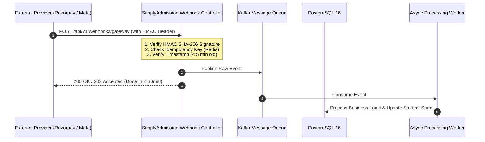

# Tutorial 10: Webhook Architecture & Security (Inbound & Outbound)

A **Webhook** is an automated HTTP event notification between two different computer systems. Think of it as a **Reverse API**: instead of you calling an external server, the external server calls your API when something happens.

In SimplyAdmission, webhooks handle the most critical events:
* **Inbound Webhooks**: Meta sends a new student ad lead; Razorpay sends a fee payment confirmation.
* **Outbound Webhooks**: SimplyAdmission notifies the School ERP when a student is officially "Enrolled".

---

## 1. The Core Lifecycle of an Inbound Webhook



---

## 2. Inbound Webhook Security: HMAC SHA-256 Signature Verification

**The Danger**: Anyone who discovers your webhook URL could send fake requests (e.g., sending a fake payload saying *"Student Aarav paid ₹25,000"*).

**The Defense: HMAC SHA-256 (Hash-based Message Authentication Code)**:
1. You and the provider (e.g., Razorpay/Meta) share a secret key (`WEBHOOK_SECRET`).
2. The provider hashes the raw request payload with this secret and sends the hash in an HTTP header (e.g., `X-Razorpay-Signature` or `X-Hub-Signature-256`).
3. Your server computes the exact same hash using your copy of the secret. If both hashes match, the payload is authentic!

### Production Java Verification Utility:
```java
package com.simplyadmission.core.security;

import javax.crypto.Mac;
import javax.crypto.spec.SecretKeySpec;
import java.nio.charset.StandardCharsets;
import java.security.MessageDigest;

public class WebhookSecurityVerifier {

    private static final String HMAC_SHA256 = "HmacSHA256";

    public static boolean verifySignature(String payload, String receivedSignature, String secret) {
        try {
            Mac mac = Mac.getInstance(HMAC_SHA256);
            SecretKeySpec secretKey = new SecretKeySpec(secret.getBytes(StandardCharsets.UTF_8), HMAC_SHA256);
            mac.init(secretKey);

            byte[] hashBytes = mac.doFinal(payload.getBytes(StandardCharsets.UTF_8));
            String expectedSignature = bytesToHex(hashBytes);

            // MessageDigest.isEqual prevents TIMING ATTACKS!
            return MessageDigest.isEqual(
                expectedSignature.getBytes(StandardCharsets.UTF_8),
                receivedSignature.getBytes(StandardCharsets.UTF_8)
            );
        } catch (Exception e) {
            return false;
        }
    }

    private static String bytesToHex(byte[] bytes) {
        StringBuilder hexString = new StringBuilder();
        for (byte b : bytes) {
            String hex = Integer.toHexString(0xff & b);
            if (hex.length() == 1) hexString.append('0');
            hexString.append(hex);
        }
        return hexString.toString();
    }
}
```

---

## 3. Idempotency: Defending Against Duplicate Deliveries

Payment gateways and ad networks **will retry webhooks** if your server takes more than 5 seconds to answer or if there is a network glitch.

If Razorpay delivers the same "Payment Success" webhook 3 times:
* **Without Idempotency**: The student is credited ₹25,000 three times.
* **With Idempotency**: The first execution processes the payment. The 2nd and 3rd executions detect the transaction ID in Redis and immediately return `200 OK` without doing anything.

### The Idempotent Redis Pattern:
```
1. Receive Webhook with Event ID: "evt_pay_987654"
2. Execute in Redis: SET "webhook:evt_pay_987654" "PROCESSING" NX EX 300
3. If Redis returns "null":
      -> Event is already being processed or finished! Exit immediately with 200 OK.
4. If Redis returns "OK":
      -> Process payment in PostgreSQL.
      -> Update Redis key to "COMPLETED".
```

---

## 4. Outbound Webhooks: Notifying School ERPs Reliably

When SimplyAdmission needs to notify the School ERP that a student is "Enrolled", we must handle the fact that **the school's ERP server might be offline or slow**.

### The Outbox Pattern & Dead Letter Queue (DLQ):
1. **Never make the HTTP call to the ERP inside your DB transaction**.
2. Write the event into an `outbox_events` table in PostgreSQL.
3. A background worker reads from `outbox_events` and calls the School ERP with **exponential backoff retry**:
   * Attempt 1: Immediate.
   * Attempt 2: After 30 seconds.
   * Attempt 3: After 5 minutes.
   * Attempt 4: After 1 hour.
4. If all retries fail, move the payload to a **Dead Letter Queue (DLQ)** and alert the technical support team.
