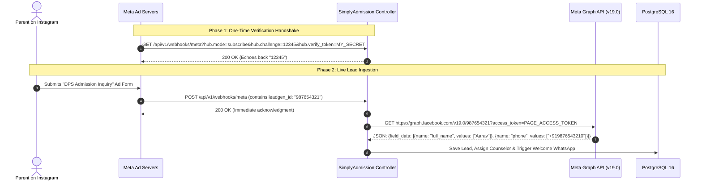

# Tutorial 11: Meta (Facebook/Instagram) Leads Integration & Graph API

Over 60% of prospective school admissions originate from Facebook and Instagram Lead Ads. Integrating with Meta requires a two-step process:
1. **The Webhook Subscription Handshake**: Meta verifies that your server is genuine using a challenge token.
2. **The Graph API Lead Retrieval**: Meta does **not** send student details in the webhook payload! It only sends a `leadgen_id`. Your server must call the Meta Graph API using an Access Token to fetch the parent's name, phone, and child's age.

---

## 1. The 2-Step Architecture



---

## 2. Step 1: Handling Meta's Verification Handshake (GET Request)

When you configure your webhook URL inside the Meta App Dashboard, Meta immediately fires a `GET` request with three query parameters:
* `hub.mode`: Always `"subscribe"`.
* `hub.verify_token`: A secret password you choose (e.g., `"simply_admission_secure_token_2026"`).
* `hub.challenge`: A random string generated by Meta (e.g., `"1158201444"`).

If your token matches, your server **must echo back the `hub.challenge` value as plain text**.

```java
@GetMapping("/api/v1/webhooks/meta")
public ResponseEntity<String> verifyWebhook(
        @RequestParam(name = "hub.mode") String mode,
        @RequestParam(name = "hub.verify_token") String verifyToken,
        @RequestParam(name = "hub.challenge") String challenge) {

    String expectedToken = "simply_admission_secure_token_2026";

    if ("subscribe".equals(mode) && expectedToken.equals(verifyToken)) {
        System.out.println("✅ Meta Webhook successfully verified!");
        return ResponseEntity.ok(challenge); // Echo back challenge
    } else {
        return ResponseEntity.status(HttpStatus.FORBIDDEN).body("Verification token mismatch");
    }
}
```

---

## 3. Step 2: Receiving the Event Notification (POST Request)

When a parent submits an ad form, Meta sends this JSON:

```json
{
  "object": "page",
  "entry": [
    {
      "id": "106428948123456",
      "time": 1709720400,
      "changes": [
        {
          "field": "leadgen",
          "value": {
            "ad_id": "2384910293019",
            "form_id": "90812389102",
            "leadgen_id": "894120938102938",
            "created_time": 1709720398,
            "page_id": "106428948123456"
          }
        }
      ]
    }
  ]
}
```

Notice: **There is NO student name or phone number here!** Why? For privacy and security reasons. We only get `"leadgen_id": "894120938102938"`.

---

## 4. Step 3: Fetching the Lead Data from Meta Graph API

Your Java backend takes the `leadgen_id` and calls Meta's Graph API:

```
GET https://graph.facebook.com/v19.0/894120938102938?access_token=YOUR_PERMANENT_PAGE_TOKEN
```

### Meta's Response with Student Data:
```json
{
  "created_time": "2026-03-06T09:30:00+0000",
  "id": "894120938102938",
  "field_data": [
    {
      "name": "full_name",
      "values": ["Aarav Sharma"]
    },
    {
      "name": "phone_number",
      "values": ["+919876543210"]
    },
    {
      "name": "email",
      "values": ["rajesh.sharma@example.com"]
    },
    {
      "name": "child_age",
      "values": ["5"]
    }
  ]
}
```

---

## 5. Complete Java Service for Parsing Meta Field Data

```java
package com.simplyadmission.core.meta;

import java.util.List;
import java.util.Map;

public class MetaLeadParser {

    public record ParsedLead(String name, String phone, String email, String age) {}

    public static ParsedLead parseMetaResponse(Map<String, Object> graphApiResponse) {
        List<Map<String, Object>> fieldData = (List<Map<String, Object>>) graphApiResponse.get("field_data");

        String name = "";
        String phone = "";
        String email = "";
        String age = "";

        for (Map<String, Object> field : fieldData) {
            String fieldName = (String) field.get("name");
            List<String> values = (List<String>) field.get("values");
            String value = (values != null && !values.isEmpty()) ? values.get(0) : "";

            switch (fieldName) {
                case "full_name" -> name = value;
                case "phone_number" -> phone = value;
                case "email" -> email = value;
                case "child_age", "grade_interested" -> age = value;
            }
        }

        return new ParsedLead(name, phone, email, age);
    }
}
```

---

## 6. Security Best Practices for Meta Integration
1. **Never Hardcode Page Access Tokens**: Store them in environment variables or AWS Secrets Manager.
2. **Always Check `X-Hub-Signature-256`**: Meta signs every incoming POST webhook with your App Secret. Verify it before fetching the lead.
3. **Handle Rate Limits (Error Code 17 / 32)**: Use Java 21 Virtual Threads and resilient retry mechanisms (Resilience4j) when calling the Graph API to prevent thread exhaustion during heavy ad campaigns.
