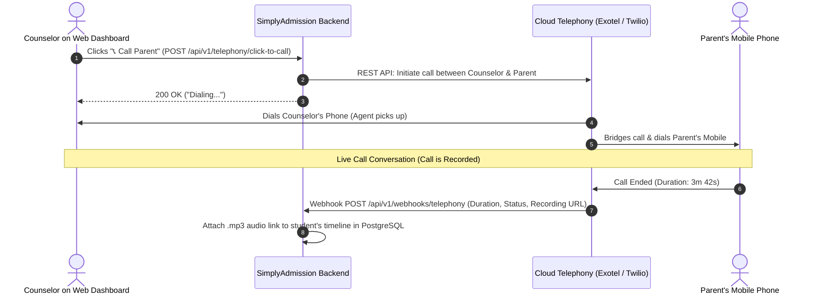

# Tutorial 13: Cloud Telephony & IVR Integration (Click-to-Call & Call Logs)

In an Admission CRM, phone conversations between admission counselors and parents are the primary driver of conversions. Integrating **Cloud Telephony (Exotel, Knowlarity, Ozonetel, Twilio)** enables two critical capabilities:
1. **Click-to-Call**: Counselors click a phone icon on the CRM screen; the system connects their phone to the parent without exposing personal mobile numbers.
2. **Inbound IVR & Call Recording Logs**: Incoming calls to the school helpline route automatically to the student's assigned counselor, and audio recordings are saved directly to the student's timeline for quality audits.

---

## 1. Click-to-Call Architecture (Outbound Calling)

How does a web browser trigger a real cellular telephone call?



---

## 2. Initiating Click-to-Call in Java

When the counselor clicks the call button on the UI, the Java backend calls the telephony provider's REST API:

```java
package com.simplyadmission.core.telephony;

import java.net.URI;
import java.net.http.HttpClient;
import java.net.http.HttpRequest;
import java.net.http.HttpResponse;

public class ClickToCallService {

    private static final String EXOTEL_API_URL = "https://api.exotel.com/v1/Accounts/{AccountSid}/Calls/connect.json";

    public static boolean initiateCall(String counselorPhone, String parentPhone, String leadId) {
        try {
            // Form body parameters required by telephony gateway
            String formData = "From=" + counselorPhone +
                              "&To=" + parentPhone +
                              "&CallerId=01140506070" + // Virtual School Number
                              "&CustomField=" + leadId;

            HttpRequest request = HttpRequest.newBuilder()
                .uri(URI.create(EXOTEL_API_URL))
                .header("Content-Type", "application/x-www-form-urlencoded")
                .header("Authorization", "Basic " + "BASE64_API_KEY_TOKEN")
                .POST(HttpRequest.BodyPublishers.ofString(formData))
                .build();

            HttpResponse<String> response = HttpClient.newHttpClient().send(request, HttpResponse.BodyHandlers.ofString());
            return response.statusCode() == 200;
        } catch (Exception e) {
            e.printStackTrace();
            return false;
        }
    }
}
```

---

## 3. Inbound IVR Routing (Parent Calls the School)

When a parent calls the school's toll-free admission number:
1. The Telephony IVR plays a greeting:
   > *"Welcome to Delhi Public School Admissions. Please hold while we connect you to your counselor."*
2. The Telephony server fires a **Real-Time Webhook** to SimplyAdmission:
   `POST /api/v1/telephony/inbound-lookup?CallerNumber=+919876543210`
3. SimplyAdmission queries PostgreSQL:
   * Is this parent already in our system?
   * If **Yes**: Return the assigned counselor's mobile number.
   * If **No**: Run the Round-Robin allocator, assign a new counselor, and return their number!
4. The telephony provider bridges the parent directly to that counselor's mobile!

---

## 4. Telephony Webhooks & Attaching Call Recordings

When the call ends, the telephony provider delivers call metrics via a webhook:

### Provider Webhook JSON Payload:
```json
{
  "CallSid": "call_98412891230",
  "From": "+919876543210",
  "To": "+919811223344",
  "Status": "completed",
  "Duration": 224,
  "RecordingUrl": "https://s3.telecom.com/recordings/call_98412891230.mp3",
  "CustomField": "lead-8942"
}
```

### Java Webhook Handler:
```java
@PostMapping("/api/v1/webhooks/telephony/call-ended")
public ResponseEntity<String> handleCallEndedWebhook(@RequestBody Map<String, Object> payload) {
    String leadId = (String) payload.get("CustomField");
    String status = (String) payload.get("Status");
    int duration = (Integer) payload.get("Duration");
    String recordingUrl = (String) payload.get("RecordingUrl");

    // 1. Insert into lead activity audit timeline
    auditLogRepository.save(new AuditLog(
        leadId,
        "PHONE_CALL",
        "Call " + status + " (" + duration + "s). Recording: " + recordingUrl
    ));

    // 2. If call was answered, increment lead engagement score
    if ("completed".equalsIgnoreCase(status) && duration > 30) {
        leadRepository.incrementEngagementScore(leadId, 15);
    }

    return ResponseEntity.ok("Call logged successfully");
}
```

---

## 5. Security & Privacy Rules in Telephony
1. **Number Masking**: Neither the counselor nor the parent sees the other’s personal mobile number. The caller ID displays the school's virtual central landline.
2. **Recording Storage**: Download the `.mp3` audio from the telecom server and re-upload it to the school's private encrypted **AWS S3** bucket to comply with data privacy policies.
3. **Counselor Working Hours**: Configure your webhook to forward calls to voicemail or an auto-SMS if a parent calls after 7:00 PM.
