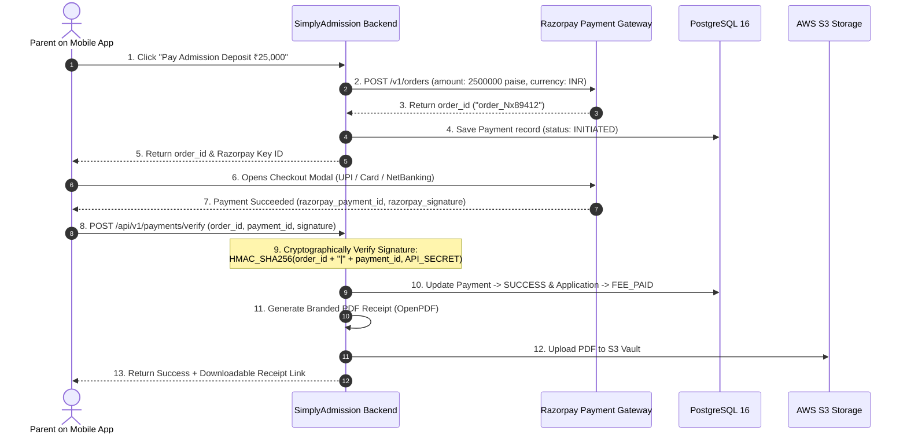

# Tutorial 14: Payment Gateway Integration & PDF Receipts (Razorpay & OpenPDF)

In SimplyAdmission, the admission journey culminates in collecting fees: Application Fees (₹1,000–₹2,500) and Admission Registration / Tuition Deposits (₹25,000–₹1,00,000).

A production payment system must guarantee three things:
1. **Never Charge Twice (Idempotency)**: Even if the parent double-clicks or their mobile network reconnects.
2. **Cryptographic Proof (Signature Verification)**: Ensuring that the payment confirmation came from the bank and was not forged.
3. **Automated GST Invoicing (Instant PDF)**: Generating an official, school-branded, tamper-proof PDF receipt and emailing it immediately.

---

## 1. The End-to-End Payment Sequence



---

## 2. Step 1: Creating the Order in Java

Razorpay requires amounts in the smallest currency sub-unit (for INR, **Paise**: ₹1 = 100 paise). ₹25,000 = `2500000` paise.

```java
package com.simplyadmission.core.payment;

import java.net.URI;
import java.net.http.HttpClient;
import java.net.http.HttpRequest;
import java.net.http.HttpResponse;
import java.util.Base64;

public class RazorpayOrderService {

    private final String keyId;
    private final String keySecret;

    public RazorpayOrderService(String keyId, String keySecret) {
        this.keyId = keyId;
        this.keySecret = keySecret;
    }

    public String createOrder(double amountInRupees, String receiptId) throws Exception {
        long amountInPaise = (long) (amountInRupees * 100);

        String jsonPayload = """
        {
          "amount": %d,
          "currency": "INR",
          "receipt": "%s",
          "payment_capture": 1
        }
        """.formatted(amountInPaise, receiptId);

        String auth = Base64.getEncoder().encodeToString((keyId + ":" + keySecret).getBytes());

        HttpRequest request = HttpRequest.newBuilder()
            .uri(URI.create("https://api.razorpay.com/v1/orders"))
            .header("Content-Type", "application/json")
            .header("Authorization", "Basic " + auth)
            .POST(HttpRequest.BodyPublishers.ofString(jsonPayload))
            .build();

        HttpResponse<String> response = HttpClient.newHttpClient().send(request, HttpResponse.BodyHandlers.ofString());
        return response.body(); // Contains "id": "order_EKwxwAgItmmXdp"
    }
}
```

---

## 3. Step 2: Cryptographic Signature Verification (HMAC-SHA256)

When the parent finishes payment, the browser sends three parameters back to our backend:
* `razorpay_order_id`
* `razorpay_payment_id`
* `razorpay_signature`

**The Verification Rule**: Razorpay hashes `order_id + "|" + payment_id` with your secret key. If your calculated hash does not match `razorpay_signature`, **someone tampered with the request**.

```java
package com.simplyadmission.core.payment;

import javax.crypto.Mac;
import javax.crypto.spec.SecretKeySpec;
import java.nio.charset.StandardCharsets;
import java.security.MessageDigest;

public class PaymentSignatureValidator {

    public static boolean verify(String orderId, String paymentId, String receivedSignature, String keySecret) {
        try {
            String payload = orderId + "|" + paymentId;
            Mac mac = Mac.getInstance("HmacSHA256");
            SecretKeySpec secretKey = new SecretKeySpec(keySecret.getBytes(StandardCharsets.UTF_8), "HmacSHA256");
            mac.init(secretKey);

            byte[] hash = mac.doFinal(payload.getBytes(StandardCharsets.UTF_8));
            
            StringBuilder hexString = new StringBuilder();
            for (byte b : hash) {
                String hex = Integer.toHexString(0xff & b);
                if (hex.length() == 1) hexString.append('0');
                hexString.append(hex);
            }

            return MessageDigest.isEqual(
                hexString.toString().getBytes(StandardCharsets.UTF_8),
                receivedSignature.getBytes(StandardCharsets.UTF_8)
            );
        } catch (Exception e) {
            return false;
        }
    }
}
```

---

## 4. Step 3: Generating Official GST PDF Receipts (OpenPDF)

Once verified, SimplyAdmission generates a branded, official PDF receipt on the fly using **OpenPDF**:

```java
package com.simplyadmission.core.payment;

import com.lowagie.text.*;
import com.lowagie.text.pdf.*;
import java.io.ByteArrayOutputStream;
import java.time.LocalDate;

public class ReceiptPdfGenerator {

    public static byte[] generateReceipt(String receiptNo, String studentName, String grade, double amount) throws Exception {
        ByteArrayOutputStream out = new ByteArrayOutputStream();
        Document document = new Document(PageSize.A4, 40, 40, 40, 40);
        PdfWriter.getInstance(document, out);

        document.open();

        // 1. School Header
        Font titleFont = FontFactory.getFont(FontFactory.HELVETICA_BOLD, 18);
        Paragraph header = new Paragraph("DELHI PUBLIC SCHOOL - ADMISSION RECEIPT\n\n", titleFont);
        header.setAlignment(Element.ALIGN_CENTER);
        document.add(header);

        // 2. Receipt Details Table
        PdfPTable table = new PdfPTable(2);
        table.setWidthPercentage(100);

        addTableRow(table, "Receipt Number:", receiptNo);
        addTableRow(table, "Date of Payment:", LocalDate.now().toString());
        addTableRow(table, "Student Name:", studentName);
        addTableRow(table, "Grade Enrolled:", grade);
        addTableRow(table, "Payment Status:", "SUCCESSFUL (PAID)");
        addTableRow(table, "Total Amount Paid:", "INR " + String.format("%.2f", amount));

        document.add(table);

        // 3. Footer
        Font footerFont = FontFactory.getFont(FontFactory.HELVETICA_OBLIQUE, 10);
        Paragraph footer = new Paragraph("\nThis is a system-generated receipt and requires no physical signature.", footerFont);
        footer.setAlignment(Element.ALIGN_CENTER);
        document.add(footer);

        document.close();
        return out.toByteArray(); // Ready to be saved to S3 and emailed to parent!
    }

    private static void addTableRow(PdfPTable table, String key, String value) {
        table.addCell(new Phrase(key, FontFactory.getFont(FontFactory.HELVETICA_BOLD, 11)));
        table.addCell(new Phrase(value, FontFactory.getFont(FontFactory.HELVETICA, 11)));
    }
}
```

---

## 5. Daily Reconciliation Cron Job

Every midnight, banks deposit the collected money minus their gateway commission into the school's account (called a **Settlement**).

A **Spring Batch / Quartz Cron Job** runs at 2:00 AM:
1. Downloads the settlement CSV file from Razorpay/Cashfree.
2. Matches each settlement transaction against internal records in the `payments` table.
3. If any payment was captured by the bank but failed to update in the CRM, the reconciliation job marks it as `SUCCESS` and logs an audit record!
