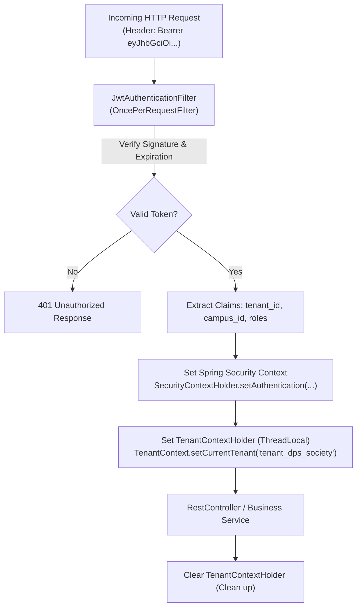

# Tutorial 16: Spring Security 6, JWT & Multi-Tenant RBAC

SimplyAdmission is a multi-tenant enterprise application. A security failure here is a legal disaster:
> *If a counselor at DPS Vasant Kunj can see or search students from Amity International, the software violates data privacy laws.*

This tutorial explains how to build a **Stateless JWT Security System** with **Tenant Isolation** and **Role-Based Access Control (RBAC)** in Spring Security 6.

---

## 1. The Multi-Tenant JWT Anatomy

A **JSON Web Token (JWT)** contains three parts separated by dots (`.`):
`HEADER.PAYLOAD.SIGNATURE`

### The JWT Payload for a SimplyAdmission User:
```json
{
  "sub": "user_89412",
  "name": "Pooja Sharma",
  "email": "pooja@dps.edu",
  "tenant_id": "tenant_dps_society",
  "campus_id": "campus_vasant_kunj",
  "roles": ["ADMISSION_COUNSELOR"],
  "iat": 1709720400,
  "exp": 1709724000
}
```
* **`tenant_id`**: The boundary. All database queries for this user will automatically filter by `tenant_dps_society`.
* **`roles`**: Determines which buttons and API endpoints the user is allowed to access.

---

## 2. The Spring Security 6 FilterChain Architecture



---

## 3. Step 1: The JWT Authentication & Tenant Filter

```java
package com.simplyadmission.core.security;

import io.jsonwebtoken.Claims;
import io.jsonwebtoken.Jwts;
import jakarta.servlet.FilterChain;
import jakarta.servlet.ServletException;
import jakarta.servlet.http.HttpServletRequest;
import jakarta.servlet.http.HttpServletResponse;
import org.springframework.security.authentication.UsernamePasswordAuthenticationToken;
import org.springframework.security.core.authority.SimpleGrantedAuthority;
import org.springframework.security.core.context.SecurityContextHolder;
import org.springframework.web.filter.OncePerRequestFilter;

import java.io.IOException;
import java.util.List;

public class JwtAuthenticationFilter extends OncePerRequestFilter {

    private final String jwtSecretKey;

    public JwtAuthenticationFilter(String jwtSecretKey) {
        this.jwtSecretKey = jwtSecretKey;
    }

    @Override
    protected void doFilterInternal(HttpServletRequest request, HttpServletResponse response, FilterChain filterChain)
            throws ServletException, IOException {

        String authHeader = request.getHeader("Authorization");

        if (authHeader == null || !authHeader.startsWith("Bearer ")) {
            filterChain.doFilter(request, response);
            return;
        }

        String token = authHeader.substring(7);

        try {
            // 1. Verify cryptographic signature & parse claims
            Claims claims = Jwts.parser()
                .setSigningKey(jwtSecretKey.getBytes())
                .parseClaimsJws(token)
                .getBody();

            String tenantId = claims.get("tenant_id", String.class);
            String campusId = claims.get("campus_id", String.class);
            List<String> roles = claims.get("roles", List.class);

            // 2. Set Multi-Tenant Context for Database queries
            TenantContextHolder.setContext(new TenantInfo(tenantId, campusId));

            // 3. Set Spring Security Authentication
            var authorities = roles.stream().map(r -> new SimpleGrantedAuthority("ROLE_" + r)).toList();
            var auth = new UsernamePasswordAuthenticationToken(claims.getSubject(), null, authorities);
            SecurityContextHolder.getContext().setAuthentication(auth);

            filterChain.doFilter(request, response);
        } catch (Exception e) {
            SecurityContextHolder.clearContext();
            response.setStatus(HttpServletResponse.SC_UNAUTHORIZED);
        } finally {
            // ALWAYS clear ThreadLocal to prevent memory leaks in thread pools!
            TenantContextHolder.clear();
        }
    }
}
```

---

## 4. Step 2: ThreadLocal Tenant Context

```java
package com.simplyadmission.core.security;

public class TenantContextHolder {

    private static final ThreadLocal<TenantInfo> CURRENT_TENANT = new ThreadLocal<>();

    public static void setContext(TenantInfo info) {
        CURRENT_TENANT.set(info);
    }

    public static TenantInfo getContext() {
        return CURRENT_TENANT.get();
    }

    public static void clear() {
        CURRENT_TENANT.remove();
    }
}

public record TenantInfo(String tenantId, String campusId) {}
```

---

## 5. Step 3: Role-Based Method Security (`@PreAuthorize`)

In Spring Boot, you can protect individual business methods with annotations:

```java
@RestController
@RequestMapping("/api/v1/admissions")
public class AdmissionController {

    // 1. Only Central Directors can add new campus branches
    @PostMapping("/campuses")
    @PreAuthorize("hasRole('SUPER_ADMIN')")
    public Campus createCampus(@RequestBody CampusDTO dto) {
        return campusService.create(dto);
    }

    // 2. Only Campus Principals or Counselors can view lead details
    @GetMapping("/leads/{id}")
    @PreAuthorize("hasAnyRole('CAMPUS_ADMIN', 'COUNSELOR')")
    public Lead getLeadDetails(@PathVariable String id) {
        return leadService.getLeadInCurrentTenant(id);
    }

    // 3. Only Accounts Officers can mark an offline payment as received
    @PostMapping("/applications/{id}/record-offline-fee")
    @PreAuthorize("hasRole('ACCOUNTANT')")
    public void recordFee(@PathVariable String id, @RequestParam double amount) {
        paymentService.recordCashReceipt(id, amount);
    }
}
```

---

## 6. Instant Token Invalidation via Redis Blacklist

Because JWTs are stateless, they normally cannot be revoked until they expire. 
* **The Problem**: A counselor is fired immediately for misconduct. Their token still has 4 hours left!
* **The Solution (Redis Blacklist)**: When the admin clicks "Deactivate Counselor", we write their token or user ID to Redis with a TTL:
  `SET blacklist:token_xyz "REVOKED" EX 14400`
* In `JwtAuthenticationFilter`, we do a 1-millisecond Redis check: if the token is in the blacklist, reject the request with `401 Unauthorized` immediately!
