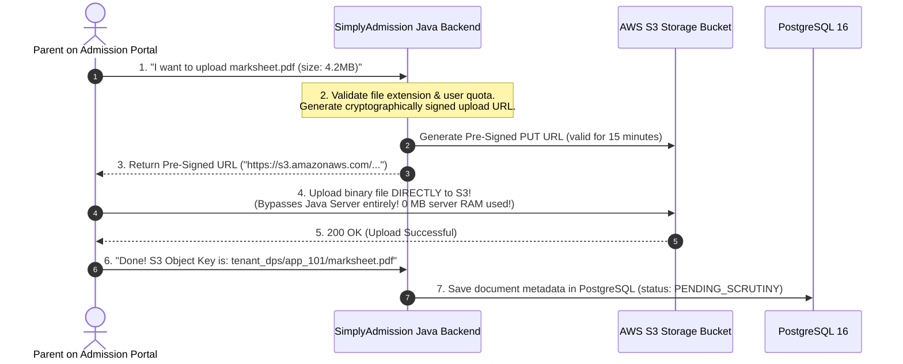

# Tutorial 17: Document Vault & AWS S3 Pre-Signed URLs

During school admissions, tens of thousands of parents upload heavy files:
* Birth Certificates (JPG/PNG)
* Previous Year Marksheets & Transfer Certificates (PDF, 2–10MB)
* Immunization Records & Aadhaar Cards

If 2,000 parents upload 5MB PDFs at the exact same hour through your Spring Boot backend, your server will attempt to buffer **10 Gigabytes of binary data in RAM**, crashing instantly with `java.lang.OutOfMemoryError`.

This tutorial explains the enterprise solution: **AWS S3 Direct-to-Cloud Uploads via Pre-Signed URLs**.

---

## 1. The Architecture of Pre-Signed URLs



---

## 2. Generating a Pre-Signed Upload URL in Java (AWS SDK v2)

```java
package com.simplyadmission.core.storage;

import software.amazon.awssdk.regions.Region;
import software.amazon.awssdk.services.s3.model.PutObjectRequest;
import software.amazon.awssdk.services.s3.presigner.S3Presigner;
import software.amazon.awssdk.services.s3.presigner.model.PresignedPutObjectRequest;
import software.amazon.awssdk.services.s3.presigner.model.PutObjectPresignRequest;

import java.time.Duration;

public class S3DocumentVaultService {

    private final S3Presigner presigner;
    private final String bucketName = "simplyadmission-documents-vault";

    public S3DocumentVaultService() {
        this.presigner = S3Presigner.builder()
            .region(Region.AP_SOUTH_1) // Mumbai Region
            .build();
    }

    public String generateUploadPresignedUrl(String tenantId, String applicationId, String filename, String contentType) {
        // Unique S3 storage path: tenant_id/application_id/uuid_filename
        String s3ObjectKey = tenantId + "/" + applicationId + "/" + System.currentTimeMillis() + "_" + filename;

        PutObjectRequest objectRequest = PutObjectRequest.builder()
            .bucket(bucketName)
            .key(s3ObjectKey)
            .contentType(contentType)
            .build();

        PutObjectPresignRequest presignRequest = PutObjectPresignRequest.builder()
            .signatureDuration(Duration.ofMinutes(15)) // URL expires in 15 minutes!
            .putObjectRequest(objectRequest)
            .build();

        PresignedPutObjectRequest presignedPutObject = presigner.presignPutObject(presignRequest);
        return presignedPutObject.url().toString();
    }
}
```

---

## 3. Frontend JavaScript: Uploading Directly to AWS S3

The browser makes a standard `PUT` request directly to the pre-signed URL:

```javascript
async function uploadStudentDocument(file, tenantId, appId) {
    // 1. Ask SimplyAdmission backend for the Pre-Signed URL
    const res = await fetch(`/api/v1/documents/presigned-url?filename=${file.name}&type=${file.type}`);
    const { uploadUrl, s3ObjectKey } = await res.json();

    // 2. Upload the file DIRECTLY to AWS S3!
    const s3Response = await fetch(uploadUrl, {
        method: "PUT",
        headers: { "Content-Type": file.type },
        body: file // Binary stream
    });

    if (s3Response.ok) {
        // 3. Inform backend that upload is complete
        await fetch("/api/v1/documents/confirm", {
            method: "POST",
            headers: { "Content-Type": "application/json" },
            body: JSON.stringify({ applicationId: appId, objectKey: s3ObjectKey, fileName: file.name })
        });
        alert("🎉 Document uploaded successfully!");
    }
}
```

---

## 4. Security & Malware Prevention in Document Vaults

Never trust file extensions submitted by users! A malicious actor can rename `trojan.exe` to `birth_certificate.pdf`.

### Defense Layer: Apache Tika Magic Byte Inspection
When our backend or worker inspects a file, it checks the **Magic Number** (the first few bytes of binary header) using **Apache Tika**:

```java
import org.apache.tika.Tika;

public class FileTypeInspector {
    private static final Tika TIKA = new Tika();

    public static boolean isSafeDocument(byte[] fileBytes) {
        String detectedMimeType = TIKA.detect(fileBytes);
        // Only allow PDF, JPEG, and PNG
        return switch (detectedMimeType) {
            case "application/pdf", "image/jpeg", "image/png" -> true;
            default -> false; // Rejects .exe, .sh, .bat, .zip
        };
    }
}
```

---

## 5. Secure Pre-Signed Download URLs (Private Buckets)

* **Rule**: Your S3 bucket must **never** be public!
* When an admission scrutiny officer or counselor clicks "View Birth Certificate", your Java backend generates a **Pre-Signed GET URL valid for only 5 minutes**.
* Once the counselor closes their tab, the URL permanently expires, ensuring student records cannot be leaked or shared online!
