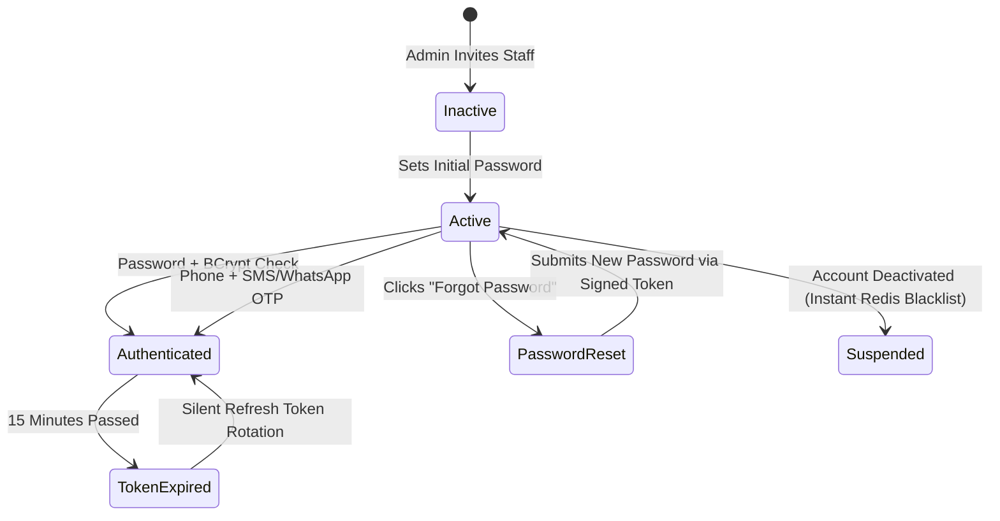
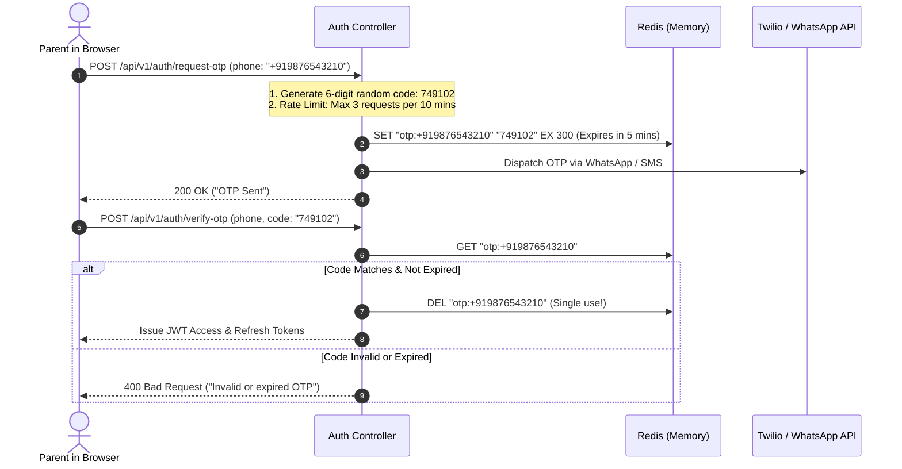

# Tutorial 21: Authentication Lifecycle, OTP Login & Role-Based Access Control (RBAC)

In SimplyAdmission, user accounts belong to different organizations (Universities, School Societies, Campuses) and have vastly different responsibilities:
* A **Central Director** oversees all campuses and revenue.
* A **School Principal** manages admissions for their specific campus.
* An **Admission Counselor** only sees leads allocated to them.
* An **Accountant** only sees fee ledgers and reconciliation reports.
* A **Parent** logs into the public portal using their mobile number and an OTP.

This tutorial covers the complete authentication lifecycle: passwords, OTPs, password reset, and role management.

---

## 1. The Authentication Lifecycle Architecture



---

## 2. Standard Login: BCrypt Password Hashing

**The Golden Rule**: You must **never** store passwords in plain text! If a hacker steals your database backup, they must not be able to read user passwords.

We use **BCrypt**, which includes a built-in cryptographic salt and an adjustable computational cost factor (work factor: 12).

```java
package com.simplyadmission.core.auth;

import org.springframework.security.crypto.bcrypt.BCryptPasswordEncoder;

public class PasswordSecurityService {

    private static final BCryptPasswordEncoder ENCODER = new BCryptPasswordEncoder(12);

    // When staff sets their password
    public static String hashPassword(String rawPassword) {
        return ENCODER.encode(rawPassword); // Returns "$2a$12$e8hY7vN..."
    }

    // When staff attempts to log in
    public static boolean verifyPassword(String rawPassword, String storedHash) {
        return ENCODER.matches(rawPassword, storedHash);
    }
}
```

---

## 3. Passwordless Mobile OTP Login (For Parents & Counselors)

Parents often forget passwords. SimplyAdmission supports **1-Click Mobile OTP Login** via SMS and WhatsApp.



### Java OTP Service Implementation:
```java
package com.simplyadmission.core.auth;

import java.security.SecureRandom;

public class OtpService {

    private static final SecureRandom RANDOM = new SecureRandom();

    public static String generate6DigitOtp() {
        int code = 100000 + RANDOM.nextInt(900000);
        return String.valueOf(code);
    }
}
```

---

## 4. Secure "Forgot Password" Workflow

When an employee forgets their password:
1. User enters their email (`pooja@dps.edu`).
2. Server generates a cryptographically secure random token (UUID or 32-byte hex).
3. Hash the token and save it in a `password_reset_tokens` table with an expiration time of **15 minutes**.
4. Email the user a reset link:
   `https://crm.simplyadmission.com/reset-password?token=a8f9482bc1948...`
5. When clicked, the backend verifies the token hasn't expired and hasn't been used yet, allows them to submit a new password, and **immediately invalidates all active sessions for that user**.

---

## 5. Multi-Tenant Role Permission Matrix

```
┌────────────────────────┬─────────────┬──────────────┬──────────────┬────────────┐
│ Role / Action          │ SUPER_ADMIN │ CAMPUS_ADMIN │ COUNSELOR    │ ACCOUNTANT │
├────────────────────────┼─────────────┼──────────────┼──────────────┼────────────┤
│ Manage School Branches │     ✅      │      ❌      │      ❌      │     ❌     │
│ View All Campus Leads  │     ✅      │      ✅      │      ❌      │     ❌     │
│ View Assigned Leads    │     ✅      │      ✅      │      ✅      │     ❌     │
│ Reassign Counselors    │     ✅      │      ✅      │      ❌      │     ❌     │
│ Collect Offline Fees   │     ✅      │      ❌      │      ❌      │     ✅     │
│ Export Student CSV     │     ✅      │      ✅      │      ❌      │     ✅     │
└────────────────────────┴─────────────┴──────────────┴──────────────┴────────────┘
```

### Spring Security Method Level Enforcement:
```java
// Central Director only
@PreAuthorize("hasRole('SUPER_ADMIN')")
public void configureNewAcademicYear() { ... }

// Campus Principal only
@PreAuthorize("hasRole('CAMPUS_ADMIN') and #campusId == authentication.principal.campusId")
public void approveOfferLetter(@PathVariable String campusId, @PathVariable String studentId) { ... }

// Assigned Counselor or Supervisor
@PreAuthorize("hasRole('CAMPUS_ADMIN') or #counselorId == authentication.principal.userId")
public void logCallNotes(@PathVariable String counselorId, @RequestBody NoteDTO note) { ... }
```
