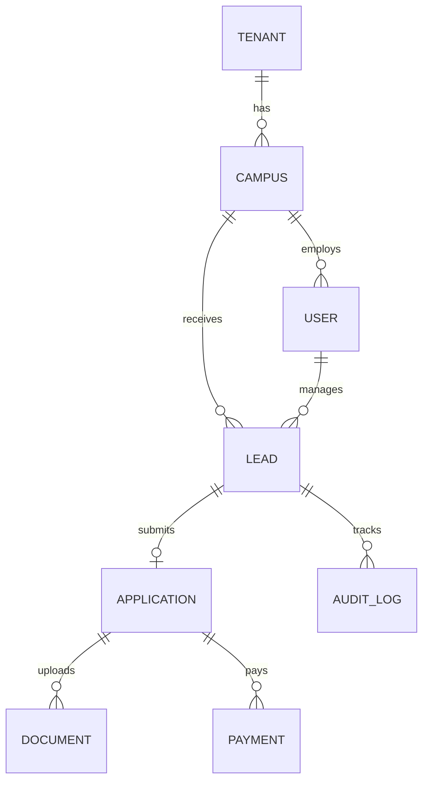
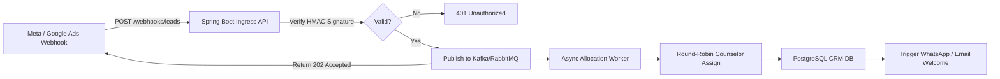

# SimplyAdmission: Core System Design & Architecture Blueprint

## 1. Domain Overview
SimplyAdmission is an enterprise multi-tenant Admission CRM tailored for K-12 schools, higher education institutions, and coaching networks. It automates the prospective student journey from top-of-funnel inquiry to confirmed classroom enrollment.

---

## 2. Core Entities & Data Dictionary

### 2.1. Tenancy & Organization Hierarchy
* **Tenant (Institution Group / University)**: Top-level isolation unit (e.g., "DPS Society", "Amity University").
* **Campus (Branch / School)**: Physical or regional branch (e.g., "DPS Vasant Kunj", "DPS Gurgaon").
* **User (Staff / Counselor)**: Internal operators with roles (`SUPER_ADMIN`, `CAMPUS_ADMIN`, `ADMISSION_COUNSELOR`, `SCRUTINY_OFFICER`, `ACCOUNTANT`).

### 2.2. Student & Admission Funnel
* **Lead (Prospect / Inquiry)**:
  * Contact info: Student name, Parent name, Phone (E.164 format), Email.
  * Marketing attribution: `utm_source`, `utm_medium`, `utm_campaign`, `ad_id`.
  * Dynamic score: Integer (0–100) reflecting engagement and profile completeness.
  * Status: `NEW`, `CONTACTED`, `CAMPUS_TOUR_BOOKED`, `APPLICATION_STARTED`, `DROPPED`.
* **Application (Formal Registration)**:
  * Course / Grade applied for.
  * Admission Cycle (e.g., "2026-2027").
  * Dynamic form attributes: Stored as PostgreSQL `JSONB` for school-specific custom fields.
  * Workflow Stage: `DRAFT`, `SUBMITTED`, `UNDER_SCRUTINY`, `ELIGIBLE`, `OFFER_ISSUED`, `ENROLLED`, `REJECTED`.
* **Document (Verification Vault)**:
  * Type: `BIRTH_CERTIFICATE`, `PREVIOUS_MARKSHEET`, `AADHAAR_CARD`, `TRANSFER_CERTIFICATE`.
  * File storage: S3 Object Key, MIME type, virus scan status (`CLEAN`, `INFECTED`, `PENDING`), verification status (`VERIFIED`, `REJECTED`).
* **Payment (Financial Ledger)**:
  * Gateway transaction ID (Razorpay/Cashfree/Stripe), payment type (`APPLICATION_FEE`, `TUITION_DEPOSIT`).
  * Amount, Currency, Status (`INITIATED`, `SUCCESS`, `FAILED`, `REFUNDED`), Idempotency Key.
* **AuditLog (Activity Trail)**:
  * Append-only chronological timeline recording every state change, call recording URL, WhatsApp dispatch, and counselor note.

---

## 3. Ingestion Pipeline Architecture

---

## 4. Architectural Rules
1. **Multi-Tenancy Guardrail**: Every entity query must include `tenant_id` and `campus_id` filter.
2. **Idempotency Mandate**: All financial and webhook transactions must accept an idempotency key to prevent double charges and duplicate leads.
3. **Async Offloading**: External communication (WhatsApp, SMS, Email, ERP webhooks) must NEVER execute inside a database `@Transactional` block.
